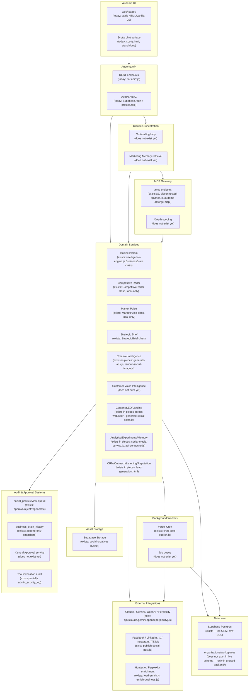

# Target Architecture

This describes the target shape requested across the 14-prompt program, mapped onto what would realistically have to change in *this* repository to reach it. It is a target to work toward across many future phases — **nothing here has been built yet**, and several boxes require explicit decisions (`DECISIONS.md`) before they can be built without guessing.

## 1. Target diagram

## 2. What "exists" vs "does not exist yet" means here

Every box above is annotated. Three categories:

- **Exists, matches shape** — a real implementation that already does what the box describes, under a different name (e.g. BusinessBrain).
- **Exists in pieces** — real, working code that covers part of the box's responsibility but isn't organized as a cohesive named service with the specific operations requested (e.g. Creative Intelligence — ad generation, scoring-adjacent framework selection, and rendering all exist, but not as one service with `scoreAdConcepts`/`checkCreativeBrandAlignment` as named, callable operations).
- **Does not exist yet** — genuinely new work: OAuth scoping, a central Approval service, Customer Voice Intelligence, Marketing Memory, a real MCP tool catalogue matching Prompt 11's list, and the Claude tool-calling orchestration loop itself.

See `IMPLEMENTATION_STATUS.md` for the full capability-by-capability breakdown.

## 3. Key structural gaps between current and target

1. **No workspace/organization boundary in the live schema.** Every domain service in the target architecture is workspace-scoped by design (Prompt 2's requirement #4: "Organisation and workspace isolation"). Today, scoping is per-`user_id` with an optional `intelligence_profiles` grouping — workable as a *stand-in* for "workspace," but not identical (no true organization-level membership/roles beyond profile-sharing). This needs an explicit decision (see `DECISIONS.md` #1).
2. **No TypeScript, no runtime schema validation library in the live `api/` layer.** Prompt 2 requires "strict TypeScript types" and "runtime validation... using the project's existing validation and ORM libraries where suitable" — there are none to reuse in the live deployment (the `zod` usage lives only inside the disconnected `audema-adforge-mcp/`). Introducing TypeScript to `api/*.js` means introducing a build step where there currently is none.
3. **Two competing MCP implementations, neither matching the target.** Prompt 11 asks for one MCP gateway with a specific tool/resource/prompt catalogue at `/mcp`. Two exist today (`api/mcp.js`, `audema-adforge-mcp/`) and neither is that gateway. A decision is needed on whether to extend one, merge both, or build a third (`DECISIONS.md` #2).
4. **No queue/worker system beyond Vercel Cron.** Fine for the one recurring job that exists today; the target's "Background Workers" box (per Prompt 5's "recurring monitoring" for Market Pulse, Prompt 9's performance ingestion) will need more than a single 15-minute cron once there's more than one recurring job — Vercel Cron's minimum interval is hourly per its own docs pattern used elsewhere in this repo, and `cron-auto-publish.js` already needs 15-minute granularity via a workaround. **UNCERTAIN**: exact Vercel Cron interval limits on the current plan — verify against the Vercel account before assuming more jobs can be added without a real queue.
5. **No billing/plan-enforcement system.** Prompt 13's "subscription-plan validation" for OAuth scopes assumes a working plan/billing system. Today, `profiles.plan` is a manually-set string with no processor behind it (see `CURRENT_ARCHITECTURE.md` §20). Scope validation can check the string, but "does this workspace's plan entitle it to this MCP scope" is meaningful only once plan changes are a real, trustworthy signal (i.e., tied to actual billing, or explicitly accepted as admin-managed for now).
6. **No central Approval service.** Two *different*, working, ad-hoc approval mechanisms already exist (`social_posts.status` for content, `business_brain_history` for BusinessBrain snapshots) — a real precedent for the pattern Prompt 14 wants generalized, but they're bespoke per-domain, not a shared service other domains (Strategic Brief, Campaign, CRM/Outreach) could plug into as-is.

## 4. Recommended sequencing implication

Because of gaps #1 and #2 above, **Prompt 2 (shared domain contracts) cannot be done honestly without first resolving DECISIONS.md #1 and #2** — the identifier/scoping shape for every entity in Prompt 2's list (Organisation, Workspace, User, Workspace membership...) depends entirely on whether "workspace" becomes a real new concept or is formalized on top of `intelligence_profiles`. Building the shared types before that decision would mean guessing, which the brief explicitly prohibits.
